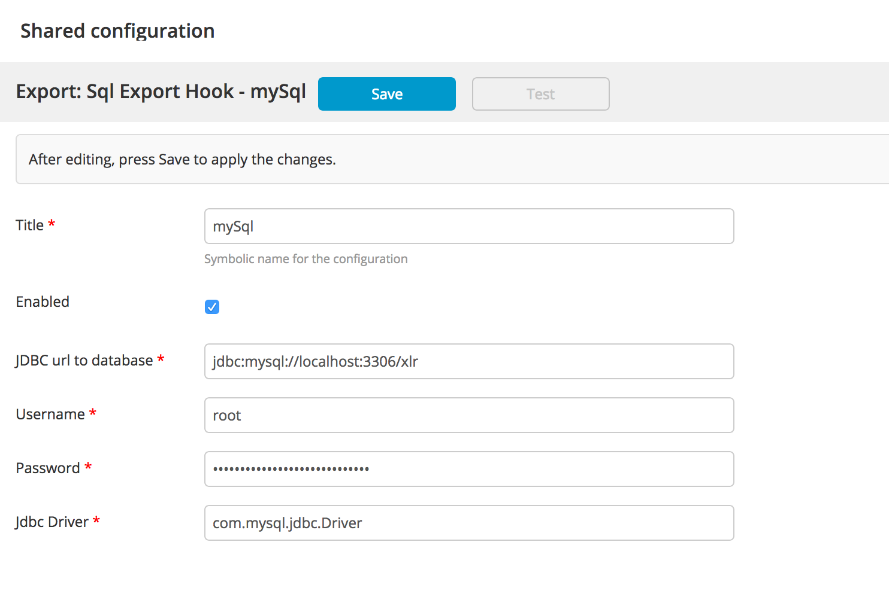
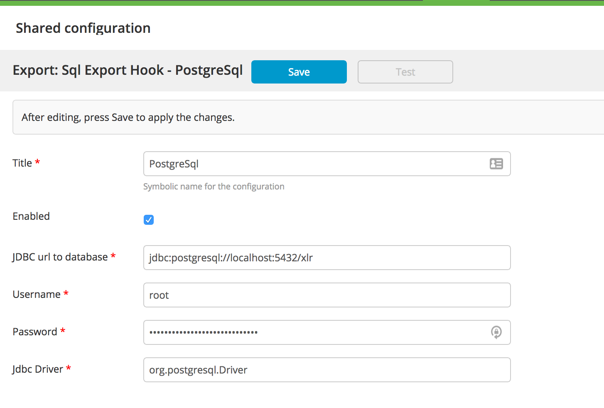

# XLR SQL Export Hook

[![Build Status][xlr-sql-export-hook-travis-image]][xlr-sql-export-hook-travis-url]
[![Codacy Badge][xlr-sql-export-hook-codacy-image] ][xlr-sql-export-hook-codacy-url]
[![License: MIT][xlr-sql-export-hook-license-image] ][xlr-sql-export-hook-license-url]
[![Github All Releases][xlr-sql-export-hook-downloads-image] ]()

[xlr-sql-export-hook-travis-image]: https://travis-ci.org/xebialabs-community/xlr-sql-export-hook.svg?branch=master
[xlr-sql-export-hook-travis-url]: https://travis-ci.org/xebialabs-community/xlr-sql-export-hook
[xlr-sql-export-hook-codacy-image]: https://api.codacy.com/project/badge/Grade/cbe6e057aa2f447c9d6e4a3092f192ad
[xlr-sql-export-hook-codacy-url]: https://www.codacy.com/app/joris-dewinne/xlr-sql-export-hook
[xlr-sql-export-hook-code-climate-image]: https://codeclimate.com/github/xebialabs-community/xlr-sql-export-hook/badges/gpa.svg
[xlr-sql-export-hook-license-image]: https://img.shields.io/badge/License-MIT-yellow.svg
[xlr-sql-export-hook-license-url]: https://opensource.org/licenses/MIT
[xlr-sql-export-hook-downloads-image]: https://img.shields.io/github/downloads/xebialabs-community/xlr-sql-export-hook/total.svg

# Overview

This export hook exports release data into sql database. It also exports phases, tasks, teams, permissions, team members, variables and tags of the release.

## Prerequisites

### My SQL or MariaDB
1. Install MySQL or MariaDB
2. Create new database with name will be used in JDBC URL
3. Download [the latest version of MySQL connector/J](http://dev.mysql.com/downloads/connector/j/) and put into `<XLRELEASE_SERVER_HOME>/plugins`

### PostgreSQL
1. Install PostgreSQL
2. Create new database with name that will be used in JDBC URL
3. Download [the latest version of PostgreSQL driver](https://jdbc.postgresql.org/download.html) and put into `<XLRELEASE_SERVER_HOME>/plugins`

## Setup

0. Make sure that your database server uses UTF-8 as default encoding otherwise, check this [mySQL link](http://stackoverflow.com/questions/3513773/change-mysql-default-character-set-to-utf-8-in-my-cnf) / [PostgreSQL link](https://www.postgresql.org/docs/9.3/static/multibyte.html)
1. Set up database schema:
	* **MySQL** `mysql -u<user> -p<password> -D <database> < ./myTables.sql`
	* **PostgreSQL** `psql <database> -U <user> -W <password> < ./pgTable.sql`
2. Copy plugin JAR to plugins folder (`<XLRELEASE_SERVER_HOME>/plugins`)

3. restart XL Release server
4. in XL Release go to `Setting -> Configuration -> Add Sql export hook`. Fill in your username, password, JDBC url:
	* **MySQL** 

	| Description | Property                              |
	|-------------|---------------------------------------|
	| JDBC URL    |`jdbc:mysql://<host>:<port>/<database>`|
	| Driver      |`com.mysql.jdbc.Driver`                |
	
	
	 
	* **PostgreSQL**

	| Description | Property                                   |
	|-------------|--------------------------------------------|
	| JDBC URL    |`jdbc:postgresql://<host>:<port>/<database>`|
	| Driver      |`org.postgresql.Driver`                     |
	
	
	
5. Check that archiving is enabled
